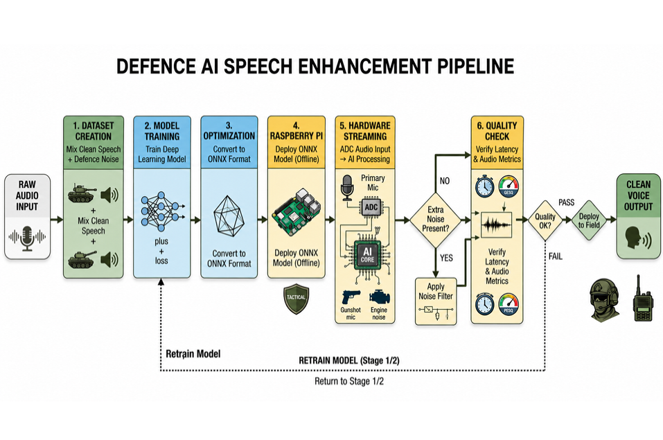

# Defence Dual-Mic Speech Enhancement

Real-time speech enhancement for a dual-mic (primary + reference) defence headset, deployed on Raspberry Pi via ONNX — built for DRDO Problem Statement 26052.

  -red)

---

## Problem Statement

- **PS ID:** 26052 (DRDO / Dept of Defence Production)
- **Category:** Hardware · **Theme:** Smart Vehicles
- **Ask:** a scalable noisy-clean dataset pipeline, a SOTA AI/ML enhancement model with perceptual loss, a training framework, a real-time edge inference engine, and a live dual-mic headset prototype

## What This Does

- Takes a dual-mic (primary + reference) audio stream and outputs enhanced, noise-suppressed speech
- Fine-tuned deep-filtering model specialized for defence-environment noise (wind, helicopter, drone, siren, gunshot, bomb explosion)
- Runs fully on-device on a Raspberry Pi — no cloud dependency, no torch/Rust needed at inference time
- File-mode, live-mic, and true continuous streaming demos included

---

## Pipeline



| Stage | What happens |
|---|---|
| 1. Dataset creation | Mix clean speech + defence noise at controlled SNR levels |
| 2. Model training | Fine-tune a deep-filtering model with a perceptual loss |
| 3. Optimization | Export trained weights to ONNX format |
| 4. Raspberry Pi | Deploy the ONNX model for fully offline inference |
| 5. Hardware streaming | Primary + reference mic ADC input → real-time AI processing |
| 6. Quality check | Verify latency, SNR, STOI, PESQ before field deployment; retrain loop if targets aren't met |

---

## Results

| Metric | Target | Achieved | Status |
|---|---|---|---|
| SNR (absolute, after enhancement) | ≥ 15 dB | 14.09 dB | just short |
| SNR improvement (informational) | — | +8.98 dB | — |
| STOI | ≥ 0.85 | 0.906 | pass |
| PESQ | ≥ 2.5 | 2.56 | pass |
| Latency | ≤ 30 ms/frame | 1.25 ms/frame | pass (laptop CPU — Pi not yet benchmarked) |

Evaluated on a 48-file held-out synthetic defence test set, disjoint from training data (see [Data](#data)).

> The problem statement says *"SNR > 15dB"*, which is ambiguous between absolute output SNR and SNR improvement. Both are reported here; the absolute value is the one judged against the target as the literal reading.

---

## Repo Structure

```
.
├── configs/
│   └── config.yaml                    # sample rate, model params, NLMS params
├── data/
│   ├── prepare_dataset.py             # builds training mixtures (mix_at_snr)
│   ├── prepare_synthetic_defence_test.py  # builds held-out eval set
│   └── split_defence_noise.py         # disjoint train/test noise split
├── demo/
│   ├── eval_onnx_wrapper.py           # batch evaluation (SNR/STOI/PESQ/latency)
│   ├── live_demo.py                   # file-mode + mic-mode demo
│   └── live_stream_onnx.py            # true continuous mic→speaker streaming
├── external/
│   └── DeepFilterNet3_finetuned/      # fine-tuned checkpoint + config.ini
├── models/
│   └── onnx_export/                   # enc.onnx, erb_dec.onnx, df_dec.onnx
├── models_phase1_baseline/            # superseded DTLN baseline checkpoints
├── models_phase2_finetune/            # superseded DTLN fine-tune checkpoints
├── src/
│   ├── audio/                         # io.py (downmix), framing.py
│   ├── evaluation/                    # metrics.py, diagnose_nlms.py
│   ├── model/                         # dtln.py (superseded), nlms.py
│   ├── training/                      # train_baseline.py, finetune_defence.py
│   ├── df_onnx_dsp.py                 # numpy DSP wrapper around the ONNX models
│   └── pipeline.py                    # enhance_audio_file_onnx() entry point
├── requirements.txt                   # full dev/training deps (torch, DeepFilterNet)
└── requirements-pi.txt                # inference-only deps (no torch, no Rust)
```

---

## Setup

**Full dev / training environment:**
```bash
pip install -r requirements.txt
```
Requires `torch==2.6.0` and `torchaudio==2.6.0` pinned exactly (newer torchaudio drops a module DeepFilterNet needs).

**Raspberry Pi / inference-only environment:**
```bash
pip install -r requirements-pi.txt
```
No torch, no Rust toolchain — just `onnxruntime` (prebuilt aarch64 wheel), numpy, scipy, soundfile, sounddevice.

---

## Usage

**Smoke test (file mode, no hardware needed):**
```bash
python demo/live_demo.py --primary noisy.wav --reference noisy.wav --clean clean.wav --onnx
```

**Live mic mode:**
```bash
python demo/live_demo.py --mic --onnx
```

**True continuous streaming (mic in, enhanced out, no record/playback delay):**
```bash
python demo/live_stream_onnx.py
```

| Flag | Purpose |
|---|---|
| `--onnx` | use the ONNX/numpy inference path (no torch needed) |
| `--onnx-dir` | folder holding the three `.onnx` files (default `models/onnx_export`) |
| `--chunk-seconds` | latency/quality tuning knob, default `2.0` |
| `--clean` | optional; enables SNR/STOI/PESQ reporting |
| `--nlms` | optional; currently **off by default** — see Limitations |

---

## Model

- Base: pretrained **DeepFilterNet3** (native 48kHz, deep-filtering architecture)
- Fine-tuned on this project's defence-noise pool via the official DeepFilterNet trainer
- 13 real fine-tuning epochs (from pretrained epoch 120 → best at epoch 132)
- Exported to ONNX (`enc.onnx`, `erb_dec.onnx`, `df_dec.onnx`) for torch-free Pi inference
- DSP layer (STFT / ERB filterbank / deep-filter fusion / iSTFT) reimplemented in plain numpy — no Rust dependency at inference time

**Config:** `sr=48000`, `fft_size=960`, `hop_size=480`, `nb_erb=32`, `nb_df=96`, `df_order=5`, `df_lookahead=2`

## Data

- **Clean speech:** VoiceBank-DEMAND (11,572 training files; 823 held-out official test-speaker files)
- **Defence noise pool:** 63 raw clips across 6 categories — Wind (7), Helicopter (9), Drone (6), Siren (14), Gun shot (15), Bomb explosion (12)
- **Mixing method:** clean speech + noise, scaled to a controlled target SNR (`mix_at_snr`), matched between training and evaluation generation
- **Train/test integrity:** noise pool is split into disjoint train/test subsets — verified no noise clip appears in both, after an earlier version was found to leak all 29 clips across both sets

---

## Known Limitations

Honest flags for the next iteration:

- **Small noise pool** — 63 raw clips across 6 categories is limited; more real recordings per category would help generalization
- **Real dual-mic domain gap** — the model performs very well on synthetic mixtures and the large majority of real-world files tested, but genuine real dual-mic captures with low inter-channel correlation (< ~0.5) are an identified weak spot; three fixes were tried (channel selection, NLMS, coherence-gating) and none fully resolved it — root cause is the model never having seen real captured dual-mic audio during training, not a fixable signal-processing step
- **NLMS is off by default** — validated in isolation on synthetic data, but real dual-mic testing showed it can partially cancel real speech (the reference channel isn't purely noise-only on real hardware); needs a double-talk detector before re-enabling
- **No Pi-hardware latency validation yet** — the 1.25ms/frame number is laptop-CPU only
- **Fine-tuning stopped early** — 13 of a planned 20 epochs, due to compute quota limits, not full convergence
- **No separate validation split** during fine-tuning — train/valid/test point at the same data internally; the fully independent 48-file evaluation set is the real generalization check
- **SNR target narrowly missed** — 14.09dB vs. the literal 15dB reading of the target (STOI and PESQ both clear their targets)

---

## Acknowledgments

- [DeepFilterNet](https://github.com/Rikorose/DeepFilterNet) (Schröter et al.) — base architecture and pretrained weights, dual-licensed MIT/Apache-2.0
- [VoiceBank-DEMAND](https://datashare.ed.ac.uk/handle/10283/2791) — clean speech corpus

## License

MIT — see [LICENSE](LICENSE).
